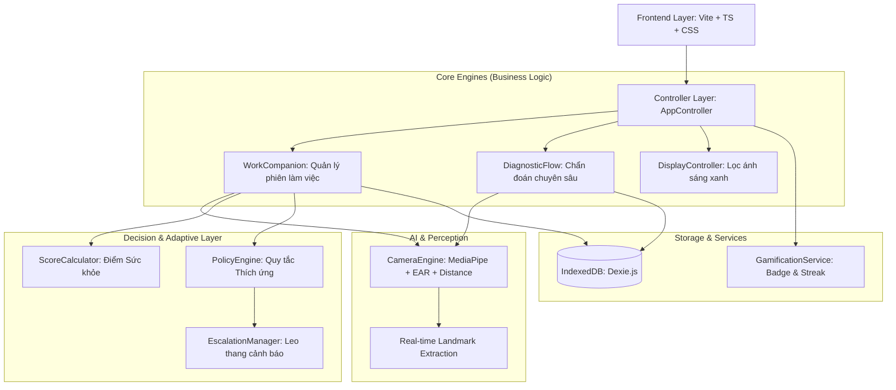

# 🏗️ Kiến trúc Thiết kế Hệ thống DryEyeGuard

Tài liệu này cung cấp cái nhìn toàn diện về kiến trúc phần mềm, các cơ chế thông minh và sơ đồ luồng dữ liệu của dự án **DryEyeGuard**.

---

## 🧭 1. Sơ đồ Kiến trúc Cấp cao (High-Level Architecture)

DryEyeGuard được thiết kế theo mô hình **Modular Monolith**, giúp chia nhỏ ứng dụng thành các module nghiệp vụ độc lập nhưng vẫn đảm bảo tính thống nhất trong môi trường Electron.

---

## 🧠 2. Các Cơ chế Thông minh "Adaptive" (Smart Mechanisms)

Điểm cốt lõi giúp DryEyeGuard vượt trội là khả năng **tự điều chỉnh** dựa trên trạng thái sinh học của người dùng.

### 📈 Hệ thống Điểm số Chớp mắt (Blink Score Logic)
Hệ thống không đánh giá dựa trên số lần chớp mắt thông thường mà tập trung vào **Chất lượng Chớp mắt**:
*   **Incomplete Blink (Chớp mắt nông)**: Nếu mi mắt không đóng hoàn toàn (EAR > threshold), hệ thống ghi nhận vi phạm.
*   **Focus Score (Điểm Tập trung)**: Điểm từ 0-100, bị trừ khi người dùng ngồi quá gần hoặc chớp mắt lỗi. Điểm này là "chìa khóa" để kích hoạt các chế độ nghỉ ngơi.

### 🔄 Quy tắc 20-20-20 Thích ứng (Adaptive 20-20-20)
*   **Trigger Condition**: Mỗi 20 phút, hệ thống kiểm tra Điểm Tập trung. Nếu điểm thấp (< 80), nhắc nghỉ ngay. Nếu điểm cao, cho phép làm việc tiếp tục để không làm gián đoạn dòng suy nghĩ (Flow state).
*   **Hard Cap**: Bắt buộc nghỉ sau 40 phút liên tục để bảo vệ mắt tuyệt đối.

### 🛡️ Tần suất Quét Camera Linh hoạt (Adaptive Frequency v3)
Hệ thống tự động dãn cách hoặc thu hẹp khoảng thời gian kiểm tra camera dựa trên mức độ ổn định của tư thế người dùng, giúp tiết kiệm tài nguyên máy tính và giảm thiểu cảm giác bị giám sát.

---

## 🛠️ 3. Ngôn ngữ & Công nghệ (Tech Stack)

| Thành phần | Công nghệ sử dụng | Mục đích |
| :--- | :--- | :--- |
| **Framework** | Electron.js v30+ | Đóng gói ứng dụng Desktop, tương tác hệ thống. |
| **Frontend** | Vite, TypeScript, Vanilla CSS | UI/UX mượt mà, kiểu dữ liệu an toàn. |
| **AI Vision** | MediaPipe Face Landmarker | Nhận diện 478 điểm khuôn mặt, tính toán EAR. |
| **Machine Learning** | ONNX Runtime Web | Dự báo rủi ro dựa trên mô hình khảo sát triệu chứng. |
| **Database** | Dexie.js (IndexedDB) | Lưu trữ lịch sử, cấu trúc thống kê và Achievements. |
| **Animations** | Canvas Confetti, CSS Transitions | Tăng trải nghiệm người dùng qua Gamification. |

---

## 📂 4. Cấu trúc Thư mục Module
*   `src/modules/camera`: Xử lý hình ảnh, đo khoảng cách, phát hiện chớp mắt.
*   `src/modules/checkup`: Quy trình chẩn đoán 2 giai đoạn (Survey + Camera).
*   `src/modules/core`: Các logic tính điểm, quản lý phiên và điều phối.
*   `src/modules/display`: Lọc màu sắc màn hình, giảm ánh sáng xanh.
*   `src/modules/edgeLighting`: Hiệu ứng viền màn hình thay thông báo truyền thống.

---
*Tài liệu này được soạn thảo chi tiết phục vụ cho hồ sơ kỹ thuật Datathon 2025.*
